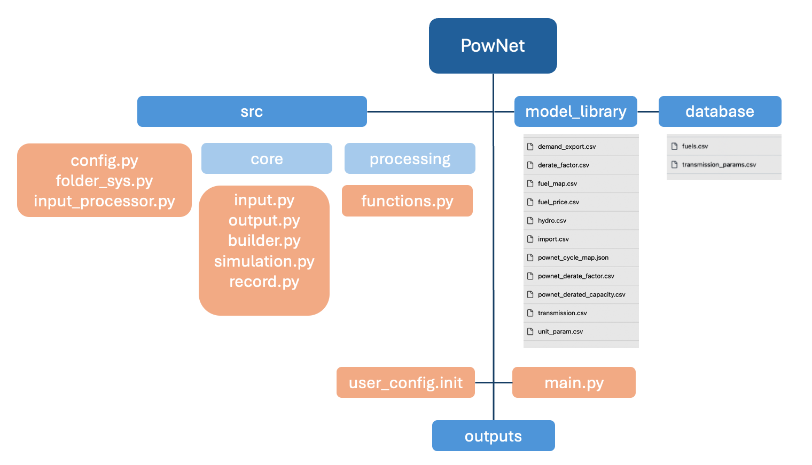

**3. Software Architecture**
============================

Install the ``sphinx_rtd_theme`` package (or add it to your ``requirements.txt`` file):

.. code:: console

    $ pip install sphinx_rtd_theme

*The folder/files structure of PowNet is summarized as follows:*

The user can make changes for the following options in ``main.py`` :

1) Choosing model region of interest (ROI):

.. code:: python

    MODEL_NAME='cambodia_2016'

2) Choosing optimization algorithm:

.. code:: python

use_gurobi ='True'

“True”: Use Gurobi

“False”: Use HiGHS

3) Choosing the simulation horizon or number of steps (number of days):

.. code:: python

T =

Choose the simulation horizon and calculate the number of steps per year=8760/T

.. code:: python

STEPS=##

Choose the number of STEPS as the number of days to run simulations

From “main.py”:

.. code:: python

record = simulator.run(steps=STEPS)

From “simulation.py”:

.. code:: python

steps_to_run = min(steps, 365 \* 24 //self.T)

4) Choosing to save results and plots or not:

.. code:: python

Save_RESULT = 'True'

Save_PLOT = 'True'

“True”: Saving results in “outputs” folder

“False”: Not saving results in “outputs” folder

PowNet Scripts Directory [Guide]
--------------------------------

+--------------+-------------------------------------------------------+
| Script       | Description                                           |
+==============+=======================================================+
| input_       | Prepare the power system paramaters (saved under      |
| processor.py | “model_library” folder) for the region of interest.   |
|              |                                                       |
|              | It uses the following files to calculate parameters:  |
|              |                                                       |
|              | 1) “transmission.csv”                                 |
|              |                                                       |
|              | 2) “transmission_params.csv”                          |
|              |                                                       |
|              | 3) “unit_param.csv” (needed for derate factor         |
|              | calculation)                                          |
|              |                                                       |
|              | 4) “fuel_map.csv” (needed for fuel price)             |
+--------------+-------------------------------------------------------+
| f            | Define the path of different folders (e.g., pownet    |
| older_sys.py | directory, inputs, outputs)                           |
+--------------+-------------------------------------------------------+
| config.py    | Read the configurations for PowNet and Gurobi from    |
|              | “user_config.init”                                    |
+--------------+-------------------------------------------------------+
| functions.py | Contains functions to process user inputs including:  |
|              |                                                       |
|              | 1) get_dates()                                        |
|              |                                                       |
|              | 2) get_fuel_prices()                                  |
|              |                                                       |
|              | 3) create_init_condition()                            |
|              |                                                       |
|              | 4) get_linecap()                                      |
+--------------+-------------------------------------------------------+
| builder.py   | Contains “ModelBuilder” class to build the model by   |
|              | adding unit commitment constraints [using equations   |
|              | from Kneuven et al (2019)]                            |
+--------------+-------------------------------------------------------+
| input.py     |                                                       |
+--------------+-------------------------------------------------------+
| record.py    | Contains functions to record/write simulation         |
|              | variables/outputs including:                          |
|              |                                                       |
|              | 1) write_df()                                         |
|              |                                                       |
|              | 2) SystemRecord.to_csv() [called by “simulation.py”]  |
+--------------+-------------------------------------------------------+
| s            | Contains functions to run simulation including        |
| imulation.py | “Simulator.run”                                       |
+--------------+-------------------------------------------------------+
| output.py    | Contains functions to postprocess outputs and produce |
|              | plots including the following classes:                |
|              |                                                       |
|              | 1) OutputProcessor                                    |
|              |                                                       |
|              | 2) Visulaizer                                         |
+--------------+-------------------------------------------------------+

:mark:`PowNet Input Files Directory [Guide]`
---------------------------------------------

+---------------------+------------------------------------------------+
| File                | Description                                    |
+=====================+================================================+
| fuels.csv           |                                                |
+---------------------+------------------------------------------------+
| tran                |                                                |
| smission_params.csv |                                                |
+---------------------+------------------------------------------------+
| transmission.csv    |                                                |
+---------------------+------------------------------------------------+
| unit_param.csv      |                                                |
+---------------------+------------------------------------------------+
| fuel_map.csv        |                                                |
+---------------------+------------------------------------------------+
| fuel_price.csv      |                                                |
+---------------------+------------------------------------------------+
| demand_export.csv   |                                                |
+---------------------+------------------------------------------------+
| derate_factor.csv   |                                                |
+---------------------+------------------------------------------------+
| hydro.csv           |                                                |
+---------------------+------------------------------------------------+
| import.csv          |                                                |
+---------------------+------------------------------------------------+
| po                  |                                                |
| wnet_cycle_map.json |                                                |
+---------------------+------------------------------------------------+
| powne               |                                                |
| t_derate_factor.csv |                                                |
+---------------------+------------------------------------------------+
| pownet_d            |                                                |
| erated_capacity.csv |                                                |
+---------------------+------------------------------------------------+
| renewable.csv       | Postprocessing of VICRes output                |
+---------------------+------------------------------------------------+

**Examples of Input Files:**

:mark:`“\ **model_library/laos”**`

|image3|

**:mark:`“database”`**

|image4|

|image5|

|A table with numbers and letters Description automatically generated|

|image6|

:mark:`PowNet Output Files Directory [Guide]`
---------------------------------------------

+---------------------------------------+------------------------------+
| File                                  | Description                  |
+=======================================+==============================+
| YY                                    |                              |
| YYMMDD_hhmm_laos_T_flow_variables.csv |                              |
+---------------------------------------+------------------------------+
| YY                                    | hourly power values of       |
| YYMMDD_hhmm_laos_T_node_variables.csv | different power plants based |
|                                       | on nodes type (vartype)      |
+---------------------------------------+------------------------------+
| YYYYMMDD\_                            |                              |
| hhmm_laos_T_system_variables.csv      |                              |
+---------------------------------------+------------------------------+
| YYYYMMDD_hhmm_laos_fuelmix.png        |                              |
+---------------------------------------+------------------------------+
| YYYYMMDD_hhmm_unit_plots/             |                              |
| YYYYMMDD_hhmm \_laos_XXXXX.png        |                              |
+---------------------------------------+------------------------------+

|image7|\ **Examples of output files:**

|A screenshot of a table Description automatically
generated|\ |image8|\ **
**
