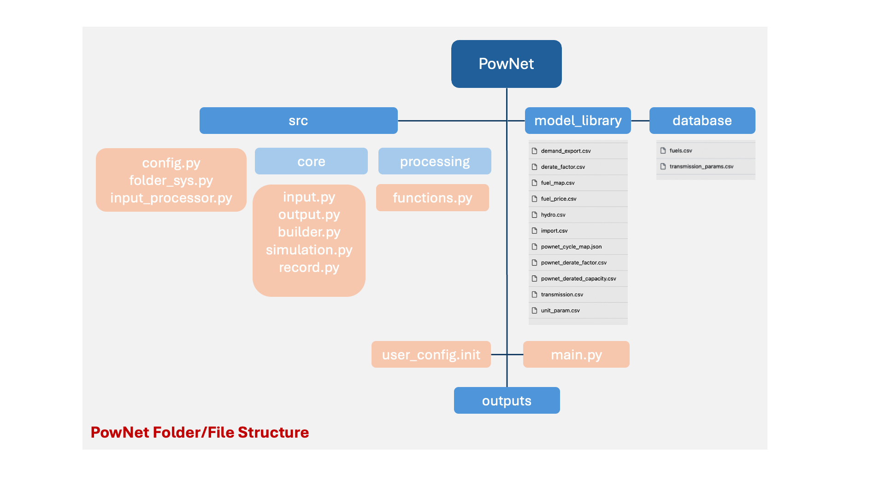

**3. Software Architecture**
============================

The folder/files structure of PowNet is summarized as follows:

The user can make changes for the following options in ``main.py`` :

1) Choosing region of interest and year of simulation:

.. code:: python

    MODEL_NAME='cambodia_2016'

2) Choosing optimization algorithm:

.. code:: python

   use_gurobi=False

*``False`` means to use HiGHS solver optimization and ``True`` means to use ``Gurobi`` solver.*

3) Choosing the simulation horizon or number of steps (number of days to run simulations):

.. code:: python

   T=24

.. code:: python

   STEPS=5

4) Choosing to save results and plots in ``outputs`` folder:

.. code:: python

   Save_RESULT = True

   Save_PLOT = True

PowNet Scripts
--------------

+--------------------------+-------------------------------------------------------+
| Script                   | Description                                           |
+==========================+=======================================================+
| input_processor.py       | Prepare the power system paramaters (saved under      |
|                          | “model_library” folder) for the region of interest.   |
|                          |                                                       |
|                          | It uses the following files to calculate parameters:  |
|                          |                                                       |
|                          | 1) ``transmission.csv``                               |
|                          |                                                       |
|                          | 2) ``transmission_params.csv``                        |
|                          |                                                       |
|                          | 3) ``unit_param.csv`` (needed for derate factor       |
|                          | calculation)                                          |
|                          |                                                       |
|                          | 4) ``fuel_map.csv`` (needed for fuel price)           |
+--------------------------+-------------------------------------------------------+
| folder_sys.py            | Define the path of different folders (e.g., pownet    |
|                          | directory, inputs, outputs)                           |
+--------------------------+-------------------------------------------------------+
| config.py                | Read the configurations for PowNet and Gurobi from    |
|                          | “user_config.init”                                    |
+--------------------------+-------------------------------------------------------+
| functions.py             | Contains functions to process user inputs including:  |
|                          |                                                       |
|                          | 1) get_dates()                                        |
|                          |                                                       |
|                          | 2) get_fuel_prices()                                  |
|                          |                                                       |
|                          | 3) create_init_condition()                            |
|                          |                                                       |
|                          | 4) get_linecap()                                      |
+--------------------------+-------------------------------------------------------+
| builder.py               | Contains “ModelBuilder” class to build the model by   |
|                          | adding unit commitment constraints [using equations   |
|                          | from Kneuven et al (2019)]                            |
+--------------------------+-------------------------------------------------------+
| input.py                 |  Read the user inputs that define the power system    |
|                          |  over one year including:                             |
|                          |                                                       |
|                          |  1) demand_export.csv                                 |
|                          |                                                       |
|                          |  2) pownet_derate_factor.csv                          |
|                          |                                                       |
|                          |  3) fuel_price.csv                                    |
|                          |                                                       |
+--------------------------+-------------------------------------------------------+
| record.py                | Contains functions to record/write simulation         |
|                          | variables/outputs including:                          |
|                          |                                                       |
|                          | 1) write_df()                                         |
|                          |                                                       |
|                          | 2) SystemRecord.to_csv() [called by “simulation.py”]  |
+--------------------------+-------------------------------------------------------+
| simulation.py            | Contains functions to run simulation including        |
|                          | “Simulator.run”                                       |
+--------------------------+-------------------------------------------------------+
| output.py                | Contains functions to postprocess outputs and produce |
|                          | plots including the following classes:                |
|                          |                                                       |
|                          | 1) OutputProcessor                                    |
|                          |                                                       |
|                          | 2) Visulaizer                                         |
+--------------------------+-------------------------------------------------------+

:mark:`PowNet Input Files Directory [Guide]`
---------------------------------------------

+---------------------+------------------------------------------------+
| File                | Description                                    |
+=====================+================================================+
| fuels.csv           |                                                |
+---------------------+------------------------------------------------+
| tran                |                                                |
| smission_params.csv |                                                |
+---------------------+------------------------------------------------+
| transmission.csv    |                                                |
+---------------------+------------------------------------------------+
| unit_param.csv      |                                                |
+---------------------+------------------------------------------------+
| fuel_map.csv        |                                                |
+---------------------+------------------------------------------------+
| fuel_price.csv      |                                                |
+---------------------+------------------------------------------------+
| demand_export.csv   |                                                |
+---------------------+------------------------------------------------+
| derate_factor.csv   |                                                |
+---------------------+------------------------------------------------+
| hydro.csv           |                                                |
+---------------------+------------------------------------------------+
| import.csv          |                                                |
+---------------------+------------------------------------------------+
| po                  |                                                |
| wnet_cycle_map.json |                                                |
+---------------------+------------------------------------------------+
| powne               |                                                |
| t_derate_factor.csv |                                                |
+---------------------+------------------------------------------------+
| pownet_d            |                                                |
| erated_capacity.csv |                                                |
+---------------------+------------------------------------------------+
| renewable.csv       | Postprocessing of VICRes output                |
+---------------------+------------------------------------------------+

**Examples of Input Files:**

:mark:`“\ **model_library/laos”**`

|image3|

**:mark:`“database”`**

|image4|

|image5|

|A table with numbers and letters Description automatically generated|

|image6|

:mark:`PowNet Output Files Directory [Guide]`
---------------------------------------------

+---------------------------------------+------------------------------+
| File                                  | Description                  |
+=======================================+==============================+
| YY                                    |                              |
| YYMMDD_hhmm_laos_T_flow_variables.csv |                              |
+---------------------------------------+------------------------------+
| YY                                    | hourly power values of       |
| YYMMDD_hhmm_laos_T_node_variables.csv | different power plants based |
|                                       | on nodes type (vartype)      |
+---------------------------------------+------------------------------+
| YYYYMMDD\_                            |                              |
| hhmm_laos_T_system_variables.csv      |                              |
+---------------------------------------+------------------------------+
| YYYYMMDD_hhmm_laos_fuelmix.png        |                              |
+---------------------------------------+------------------------------+
| YYYYMMDD_hhmm_unit_plots/             |                              |
| YYYYMMDD_hhmm \_laos_XXXXX.png        |                              |
+---------------------------------------+------------------------------+

|image7|\ **Examples of output files:**

|A screenshot of a table Description automatically
generated|\ |image8|\ **
**
